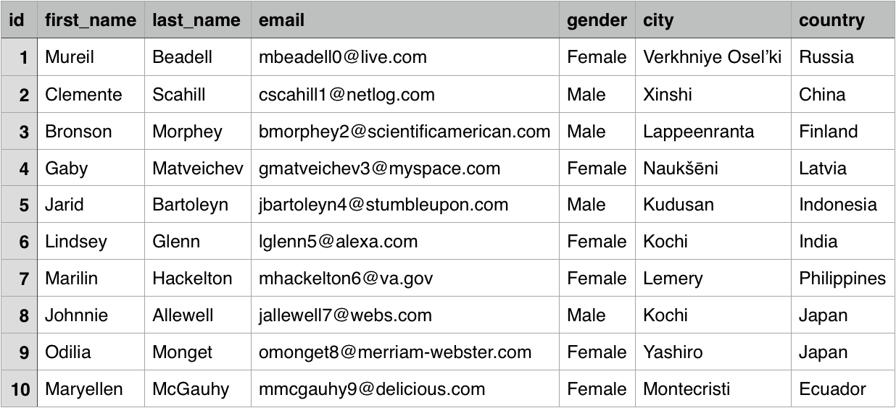
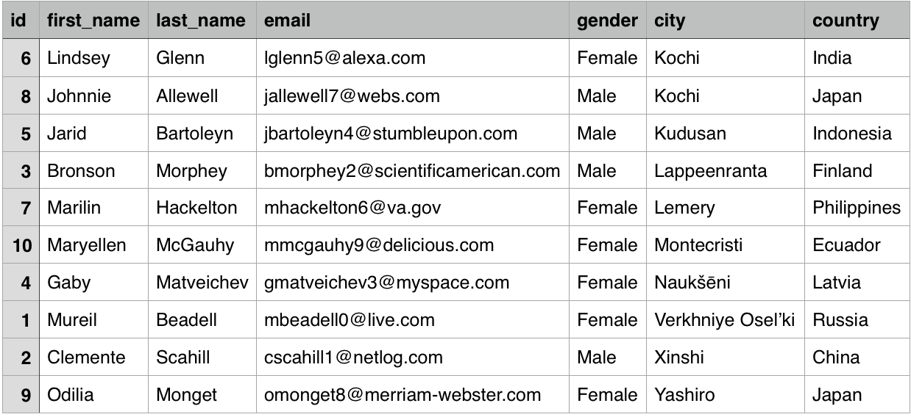
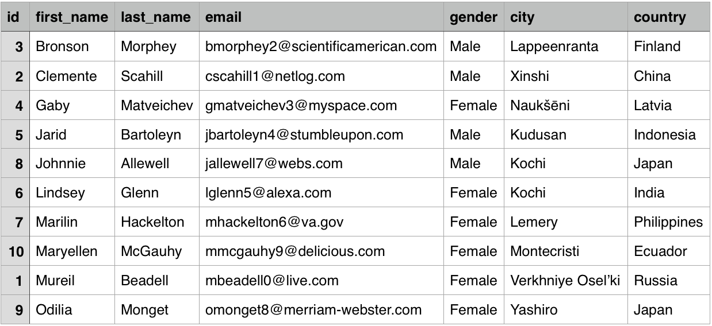
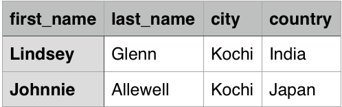
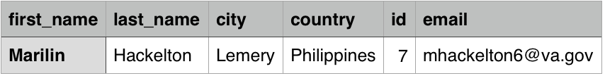
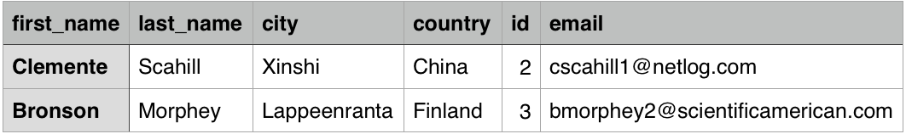

# Csv Analytics
Process large csv files
- Sort csv files upto ~100gb on multiple columns.
  - Files larger than 100gb also supported, provided sufficient storage space is available, please refer to notes section.

- Formatting csv file.
  - Performing sql-like operations on large csv file ~100gb.
  - `select first_name,last_name,city,country,id,email where first_name = 'Bronson' or (country = 'China' and city = 'Xinshi')`

## Input sample csv file

## Build the jar
`gradle shadowJar`

## 1. Sort on city,country
`java -cp build/libs/csort.jar org.tools.csv.sort.CsvMergeSorter -n city,country -i employee-details.csv -o city-sorted.csv -m yes -s`

## 2. Sort on first_name
`java -cp build/libs/csort.jar org.tools.csv.sort.CsvMergeSorter -n first_name -i employee-details.csv -o first-name-sorted.csv -m yes -s`

## 3. Format: where city = 'Kochi'
`java -cp ./build/libs/csort.jar org.tools.csv.format.CsvFormatter -i employee-details.csv -o select1.csv -e "select first_name,last_name,city,country where city = 'Kochi'"`

## 4. Format: where email like '%gov'
`java -cp ./build/libs/csort.jar org.tools.csv.format.CsvFormatter -i employee-details.csv -o gov.csv -e "select first_name,last_name,city,country,id,email where email like '%gov'"`

## 5. Format: Nested expression
`java -cp ./build/libs/csort.jar org.tools.csv.format.CsvFormatter -i employee-details.csv -o complex.csv -e "select first_name,last_name,city,country,id,email where first_name = 'Bronson' or (country = 'China' and city = 'Xinshi')"`

## For help and other options
`java -cp build/libs/csort.jar org.tools.csv.sort.CsvMergeSorter --help`

## Note:
- Please ensure that there is free diskspace on target machine at-least thrice the size of file.
  i.e. if the file to sort is of size 1gb there must be atleast 3gb free space on disk.
- Csv without column names can be sorted by using option c, please provide option `-m no` in such case.
- When using option c, 0 is first column of csv, 1 is second column of csv and so on..
